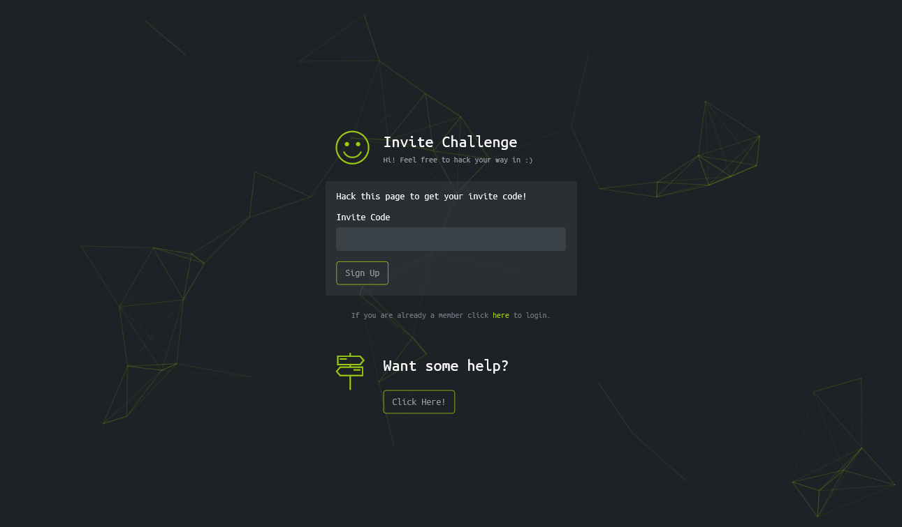

# Invite Challenge

Hack The Boxの登録を行う。  
Join Nowボタンを押すと以下の画面になる。  
  
もちろんInvite Codeを持っていないが、どうやら拾ってくるようだ。  
`https://www.hackthebox.eu/js/inviteapi.min.js`へのアクセスが見られるため見てみる。  
以下のように記述されていた。  
```JavaScript
//This javascript code looks strange...is it obfuscated???

eval(function(p,a,c,k,e,r){e=function(c){return c.toString(a)};if(!''.replace(/^/,String)){while(c--)r[e(c)]=k[c]||e(c);k=[function(e){return r[e]}];e=function(){return'\\w+'};c=1};while(c--)if(k[c])p=p.replace(new RegExp('\\b'+e(c)+'\\b','g'),k[c]);return p}('0 3(){$.4({5:"6",7:"8",9:\'/b/c/d/e/f\',g:0(a){1.2(a)},h:0(a){1.2(a)}})}',18,18,'function|console|log|makeInviteCode|ajax|type|POST|dataType|json|url||api|invite|how|to|generate|success|error'.split('|'),0,{}))
```
難読化を[Online JavaScript Beautifier](https://beautifier.io/)で解除すると以下になる。  
```JavaScript
//This javascript code looks strange...is it obfuscated???

function makeInviteCode() {
    $.ajax({
        type: "POST",
        dataType: "json",
        url: '/api/invite/how/to/generate',
        success: function(a) {
            console.log(a)
        },
        error: function(a) {
            console.log(a)
        }
    })
}
```
curlでPOSTする。  
```bash
$ curl -X POST https://www.hackthebox.eu/api/invite/how/to/generate
{"success":1,"data":{"data":"Va beqre gb trarengr gur vaivgr pbqr, znxr n CBFG erdhrfg gb \/ncv\/vaivgr\/trarengr","enctype":"ROT13"},"hint":"Data is encrypted \u2026 We should probably check the encryption type in order to decrypt it\u2026","0":200}
$ curl -X POST https://www.hackthebox.eu/api/invite/how/to/generate
{"success":1,"data":{"data":"SW4gb3JkZXIgdG8gZ2VuZXJhdGUgdGhlIGludml0ZSBjb2RlLCBtYWtlIGEgUE9TVCByZXF1ZXN0IHRvIC9hcGkvaW52aXRlL2dlbmVyYXRl","enctype":"BASE64"},"hint":"Data is encrypted \u2026 We should probably check the encryption type in order to decrypt it\u2026","0":200}
```
ROT13でもBASE64でもよいがデコードすると`In order to generate the invite code, make a POST request to /api/invite/generate`になる。  
もう一回POSTする。  
```bash
$ curl -X POST https://www.hackthebox.eu/api/invite/generate
{"success":1,"data":{"code":"QkZZQ0gtQ1VXWFMtUEhFVEMtRFlIVkUtT0dYTEE=","format":"encoded"},"0":200}
```
もう一回、BASE64デコードすると`BFYCH-CUWXS-PHETC-DYHVE-OGXLA`が手に入る。  
Invite Codeはこれ(変動する)。  